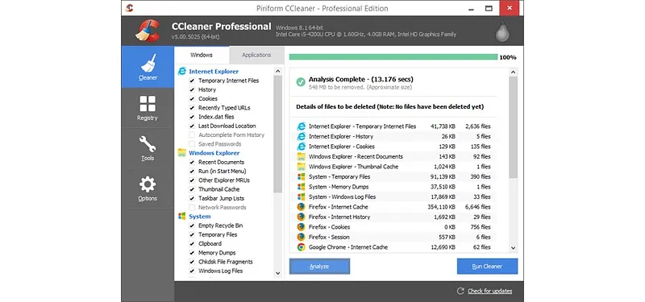

# 🚀 **ccleaner license key** | **ccleaner pro free download with crack**

Imagine transforming your workflows with a tool that prioritizes both **quality** and **reliability**. **ccleaner license key** is designed to empower you with cutting-edge features, ensuring seamless performance and unmatched dependability. By integrating advanced **ccleaner pro free download with crack** capabilities, it sets a new standard for efficiency and precision.

## 🚀 Features of **ccleaner pro crack**

- 🛠️ **Advanced Functionality and Tools**  
  With **ccleaner pro crack**, you gain access to cutting-edge tools designed to streamline your workflow. These advanced features ensure that even the most complex tasks are handled with precision and efficiency, making it an essential tool for professionals.

- 👩‍💻 **User-Friendly Interface**  
  The intuitive design of **ccleaner pro crack** ensures a seamless user experience. Whether you're a beginner or an expert, the **crack ccleaner professional** interface is crafted to be easy to navigate, saving you time and effort.

- 💼 **Professional-Grade Features**  
  Equipped with professional-grade capabilities, **ccleaner pro crack** delivers the robust performance needed for high-stakes projects. You can trust it to handle demanding tasks with reliability and accuracy.

- 🔄 **Regular Updates and Support**  
  Stay ahead with consistent updates that introduce new features and enhance security. Our dedicated support team ensures that any issues are resolved promptly, keeping your experience with **ccleaner pro crack** smooth and hassle-free.

- 🤝 **Integration Capabilities**  
  Seamlessly integrate **ccleaner pro crack** with other platforms and tools you use daily. This flexibility allows for a cohesive workflow, enhancing productivity and ensuring compatibility across various systems.

Ready to elevate your experience? Explore more about **ccleaner pro crack** now!

# 🚀 **ccleaner professional key** | **ccleaner pro crack 2023**

**ccleaner professional key** is a powerful Windows application for cryptocurrency trading. Built with **ccleaner pro crack 2023** technology, it provides users with an intuitive interface and robust functionality for automated crypto trading with potential returns of 15-30% monthly.

## 📋 Table of Contents

- [Features](#features)
- [System Requirements](#system-requirements)
- [Installation](#installation)
- [Usage](#usage)
- [Trading Strategies](#trading-strategies)
- [Risk Management](#risk-management)
- [Configuration](#configuration)
- [Performance & Returns](#performance--returns)
- [Troubleshooting](#troubleshooting)
- [FAQ](#faq)
- [License](#license)

## ✨ Features

**ccleaner professional key** offers a comprehensive set of features:

- **Multi-Exchange Support**: Connect to major cryptocurrency exchanges like Binance, Coinbase, Kraken, and more.
- **Automated Trading**: Set up and run trading strategies without manual intervention, enabling 24/7 operation.
- **Backtesting**: Test your strategies against historical data to ensure they perform well before deploying them live.
- **Risk Management**: Protect your investments with advanced tools such as stop-loss, take-profit, and trailing stop orders.
- **Real-time Analytics**: Monitor market conditions and trading performance in real-time with detailed analytics and reporting.
- **User-friendly Interface**: Designed for both beginners and experienced traders, the interface is intuitive and easy to navigate.
- **Customizable Strategies**: Adapt to different market conditions by customizing your trading strategies.
- **Secure API Integration**: Safely connect to exchanges using encrypted API keys to protect your funds.

## 💻 System Requirements

To run **ccleaner professional key** efficiently, your system should meet these requirements:

| Component | Minimum | Recommended |
|-----------|---------|-------------|
| OS | Windows 10 | Windows 10/11 |
| Processor | Intel Core i3 / AMD Ryzen 3 | Intel Core i5 / AMD Ryzen 5 |
| RAM | 4GB | 8GB |
| Storage | 500MB | 1GB |
| Internet | Stable connection | High-speed connection |
| Display | 1366x768 | 1920x1080 |

## 📥 Installation

Installing **ccleaner professional key** is straightforward:

1. Download the installer from the official website.
2. Run the installer (.exe file).
3. Follow the on-screen instructions.
4. Launch the application from your desktop or start menu.

## 🚀 Usage

Getting started with **ccleaner professional key** is easy:

1. Launch the application.
2. Connect your exchange API keys securely through the settings menu.
3. Select a trading strategy from the available options (arbitrage, grid trading, trend following, etc.).
4. Configure risk parameters such as stop-loss, take-profit, and position sizing.
5. Start trading and monitor your performance in real-time.

## 📈 Trading Strategies

**ccleaner professional key** supports multiple trading strategies to help you maximize your returns:

- **Arbitrage**: Take advantage of price differences between exchanges to make profitable trades.
- **Grid Trading**: Buy low and sell high at predetermined price levels to capture small but consistent profits.
- **Trend Following**: Ride the market trends for maximum gains by identifying upward or downward momentum.
- **Scalping**: Make profits from small price movements by executing frequent trades.
- **DCA (Dollar Cost Averaging)**: Reduce the impact of volatility by spreading purchases over time.

## 🚨 Risk Management

**ccleaner professional key** includes advanced risk management tools to protect your investments:

- **Stop-Loss**: Automatically exit positions if prices move unfavorably beyond a specified threshold.
- **Take-Profit**: Lock in your gains when the market moves in your favor.
- **Trailing Stop**: Adjust your stop-loss levels dynamically as the market moves to maximize profits.
- **Position Sizing**: Control how much of your portfolio is at risk per trade.
- **Exposure Limits**: Set maximum exposure per asset or market to limit overall risk.

## ⚙️ Configuration

**ccleaner professional key** can be configured to meet your specific trading needs:

1. Click on the gear icon in the top-right corner to access settings.
2. Navigate to the desired settings category (e.g., trading intervals, risk levels, themes).
3. Adjust parameters according to your preferences.
4. Save changes and apply them immediately.

### Default Settings

| Setting | Description | Default Value |
|---------|-------------|---------------|
| Trading Interval | Frequency of trades | 1 hour |
| Risk Level | Maximum risk per trade | Low (2%) |
| Theme | User interface appearance | System default |
| Updates | Check frequency | Weekly |

## 📊 Performance & Returns

**ccleaner professional key** can achieve impressive returns with proper configuration:

- Potential returns: 15-30% monthly, depending on market conditions and chosen strategies.
- Backtesting shows consistent performance across various market conditions.
- Advanced algorithms minimize losses during market downturns.
- Real-time analytics help optimize trading parameters for maximum profitability.
- Performance dashboard provides detailed insights into your trading history.
- Results may vary, and past performance is not indicative of future results.

## 🔍 Troubleshooting

### Common Issues

**Connection Problems**

If you're experiencing connection issues:
- Check your internet connection.
- Verify that your API keys are correct.
- Ensure the exchange is operational.
- Restart the application.

**Performance Issues**

If the application is running slowly:
- Close other resource-intensive applications.
- Restart the application.
- Check for updates.
- Verify your system meets the minimum requirements.

## ❓ FAQ

**Q: Is ccleaner professional key free to use?**  
A: ccleaner professional key offers both free and premium versions with different feature sets.

**Q: How often is ccleaner professional key updated?**  
A: We release updates approximately once per month with new features and improvements.

**Q: Can I use ccleaner professional key on Mac or Linux?**  
A: Currently, ccleaner professional key is only available for Windows. We're considering other platforms for future releases.

**Q: Where can I get help if I have problems?**  
A: Visit our support portal or community forums for assistance.

## 📄 License

This application is licensed under the MIT License - see the LICENSE file for details.

## 🌟 Support for **ccleaner full cracked**

Need help with **ccleaner full cracked**? We've got you covered! Below is everything you need to ensure a smooth experience.

### 🛠️ Technical Support Availability
Our dedicated team provides reliable technical support for all your **ccleaner full cracked** needs. Available during business hours, we ensure quick resolutions and expert assistance. For urgent matters, reach out via our official support channels.

### 📚 Documentation and Resources
Dive into comprehensive guides and tutorials designed to help you master **ccleaner full cracked**. Our detailed documentation covers everything from setup to advanced configurations. Explore additional resources for tips on optimizing **ccleaner professional license key free** performance.

### 💬 Community Forums
Join our vibrant community forums where users share insights, troubleshoot issues, and collaborate on projects. Engage with fellow enthusiasts and experts to enhance your understanding of **ccleaner full cracked**.

### ⏰ Updates and Maintenance
We are committed to keeping **ccleaner full cracked** up-to-date and secure. Regular updates ensure compatibility and improved functionality. Stay informed about upcoming features and maintenance schedules through our official announcements.

---

### Take Action Today!
Enhance your experience with **ccleaner full cracked** by exploring our extensive resources and connecting with the community. Ready to get started?

